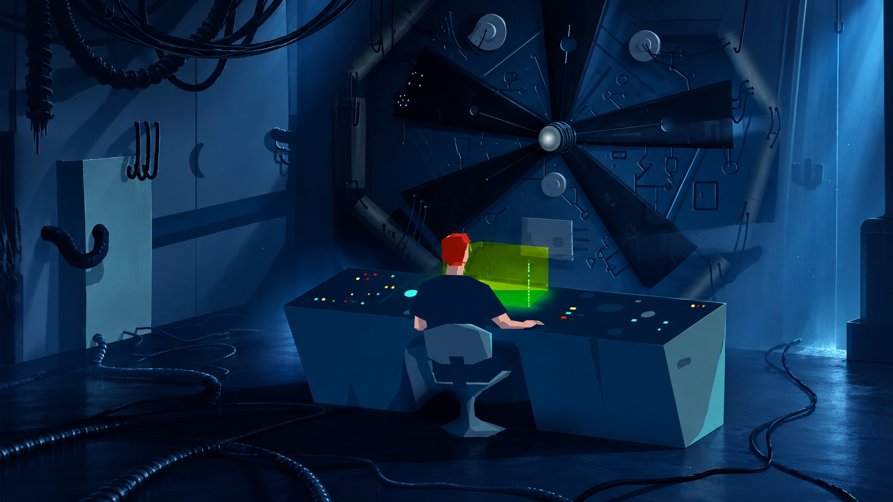

# Another World — Omarchy 4 Theme

A cinematic theme for Omarchy 4, paying tribute to **Another World**, the landmark 1991 Amiga game created by **Éric Chahi** and published by **Delphine Software**.

## From the Amiga to another desktop

Known as *Out of This World* in North America, Another World follows scientist Lester Knight Chaykin after a laboratory experiment transports him to a mysterious alien world. Its bold polygonal artwork, restrained palette and cinematic storytelling made an unforgettable impression on the Amiga era.

This project reimagines that atmosphere for [Omarchy](https://omarchy.org/): deep laboratory blues, muted alien teals, dark silhouettes and the vivid green glow of Lester’s terminal. The aim is to preserve the simplicity and sense of isolation of the original while introducing modern lighting and depth.

## Status

**Work in progress — targeting Omarchy 4.** This repository currently contains the visual direction and five generated wallpapers. Theme configuration and installation support will be added next; this is not yet an installable Omarchy theme.

## Wallpapers

The wallpapers are AI-generated reinterpretations inspired by the game, rather than original game assets.

| Scene | Wallpaper |
| --- | --- |
| Alien landscape | [View](backgrounds/alien-landscape.png) |
| Arrival at the laboratory | [View](backgrounds/arrival.png) |
| Underground escape | [View](backgrounds/underground-escape.png) |
| Alien city at twilight | [View](backgrounds/alien-city.png) |
| Lester at the laboratory console | [View](backgrounds/laboratory.png) |

## Credits and inspiration

An unofficial fan tribute to Éric Chahi and Delphine Software. Another World and its characters belong to their respective rights holders. This project is not affiliated with or endorsed by the original creators.

Historical background: [Another World](https://en.wikipedia.org/wiki/Another_World_%28video_game%29).
