# Another World · Omarchy 4

A cinematic theme for Omarchy inspired by Another World: remote alien landscapes, midnight laboratories and the green glow of a terminal.

[](backgrounds/00-arrival-4k.png)

## Backgrounds

Five wallpapers, all native 3840 × 2160. Click a preview to open the full-resolution PNG.

| | | |
| --- | --- | --- |
| [](backgrounds/00-arrival-4k.png)<br>Arrival | [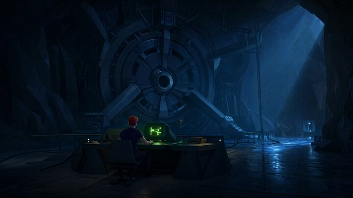](backgrounds/laboratory-4k.png)<br>The Laboratory | [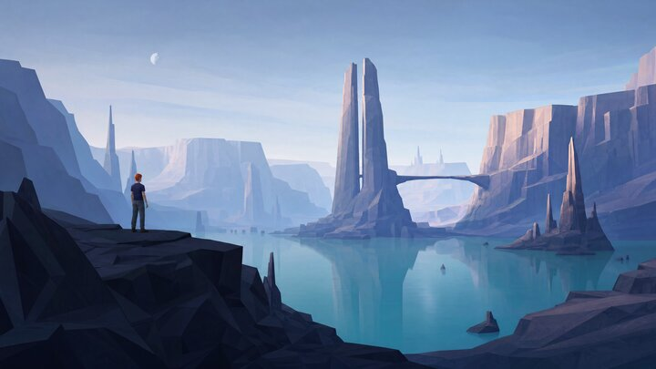](backgrounds/alien-landscape-4k.png)<br>Alien Landscape |
| [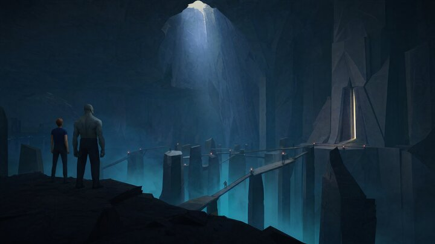](backgrounds/underground-escape-4k.png)<br>Underground Escape | [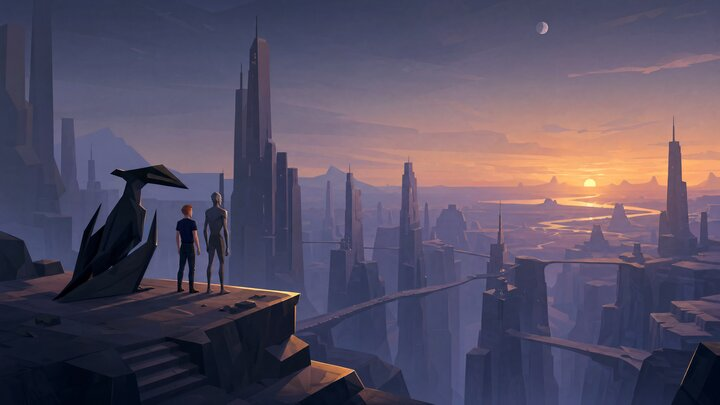](backgrounds/alien-city-4k.png)<br>Alien City at Twilight | |

[Complete scene prompts and generation settings](prompts/README.md) are included.

## Inspiration

Released in 1991, **Another World** was created by **Éric Chahi** and published by **Delphine Software**. Known as *Out of This World* in North America, it follows scientist Lester Knight Chaykin after an experiment transports him to an unfamiliar planet.

Angular silhouettes, monumental architecture and small figures against vast landscapes recall its cinematic Amiga artwork. Midnight blues and alien teals carry through the collection, with phosphor green drawn from Lester's laboratory terminal. The interface palette stays consistent as wallpapers change.

## Installation

Run on your Omarchy 4 machine:

```sh
omarchy theme install https://github.com/simoz/omarchy-another-world-theme
```

You can also enter the repository URL under **Install > Style > Theme**. To switch back, select your previous theme from Omarchy's theme menu.

## Unlock

A phosphor-green laboratory terminal brings Another World to the boot and disk-unlock screen. After installing the updated theme, select **Another World** under **Style > Unlock**.

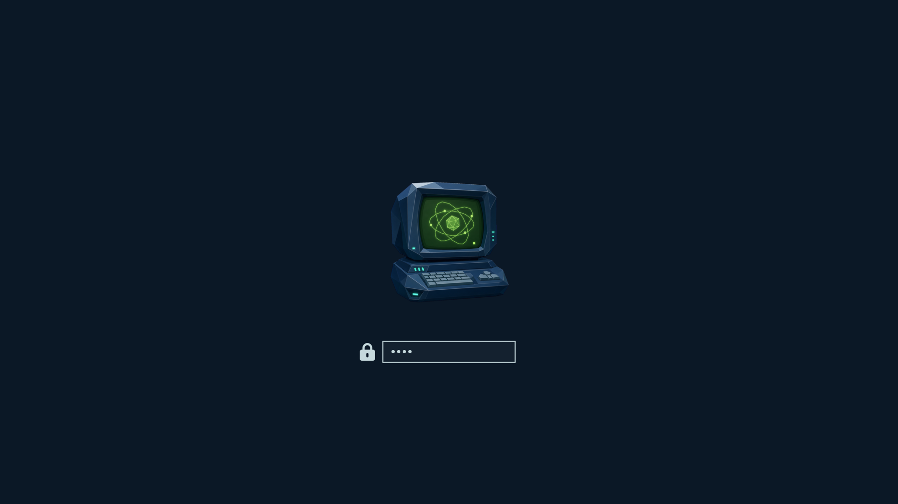

The transparent `unlock.png` and `preview-unlock.png` are included. This is a rendered preview using Omarchy’s Plymouth assets and layout; boot behavior still needs a live check. To regenerate it on Omarchy:

```sh
omarchy plymouth preview '#0b1826' '#c5d8dc' unlock.png preview-unlock.png
```

## About & screensaver

Lester and his alien companion stand together on a ledge in the optional terminal artwork.

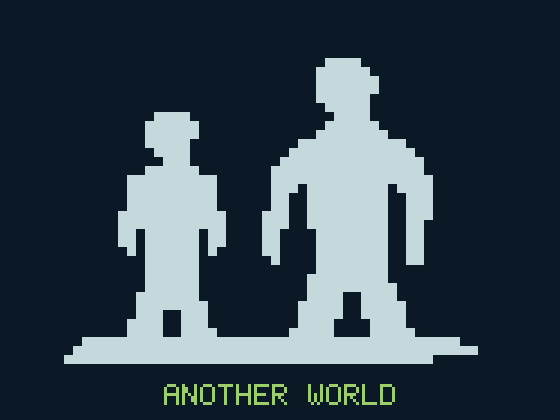

[About artwork](about.txt) and [screensaver artwork](screensaver.txt) share the same compact silhouettes and title. Omarchy supplies the screensaver animation. These are personal branding settings; selecting a theme does not install them automatically.

After installing or updating the theme, run on your Omarchy machine:

```sh
mkdir -p ~/.config/omarchy/branding
# Keep a backup of existing personal artwork before replacing it.
for name in about screensaver; do
  target="$HOME/.config/omarchy/branding/$name.txt"
  if [ -e "$target" ]; then
    cp "$target" "$target.backup-$(date +%Y%m%d-%H%M%S)"
  fi
  cp "$HOME/.config/omarchy/themes/another-world/$name.txt" "$target"
done
```

Close and reopen **About**, or open **System > Screensaver** to preview. Switching themes does not remove this artwork. Restore your backup to recover earlier custom branding; **Style > Screensaver > Restore Default** restores the Omarchy screensaver. These new text assets still need a live check.

## Shell

Opaque midnight-blue surfaces, pale blue-gray text and teal borders carry through menus, notifications, the launcher and authentication dialogs. Selected rows use deep teal; phosphor green marks focused controls and active borders. `shell.toml` leaves font and layout choices to your personal configuration, which takes precedence.

## Desktop previews

Captured on **Omarchy 4.0.3-1**, using Arrival. Click a screenshot to open it at full size. These captures show the palette before the new shell overrides and branding were added; they do not yet validate those additions.

[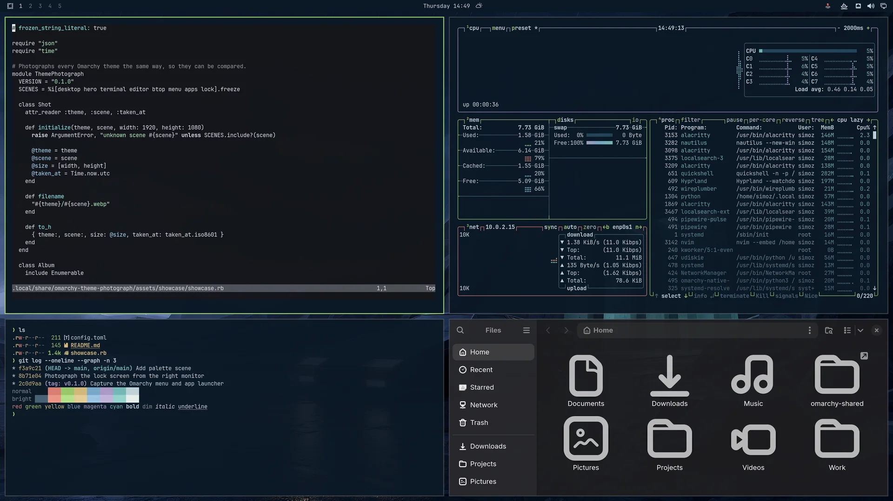](docs/screenshots/hero.webp)

| Desktop | Terminal |
| --- | --- |
| [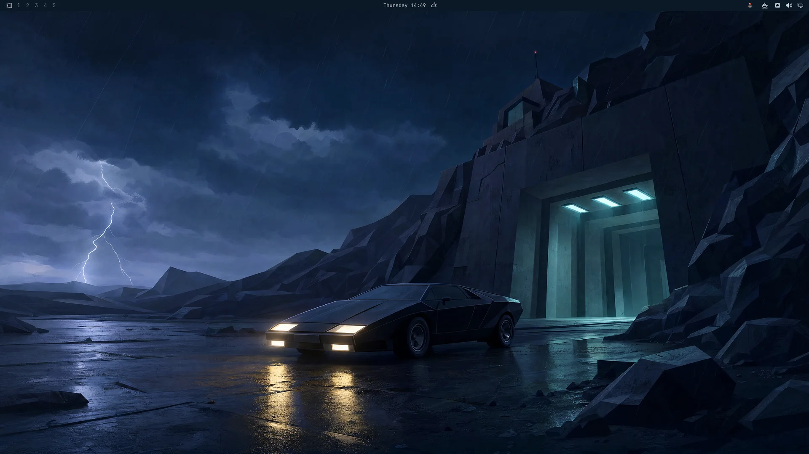](docs/screenshots/desktop.webp) | [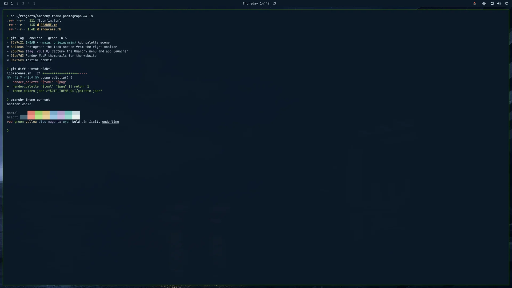](docs/screenshots/terminal.webp) |
| **Omarchy menu** | **Session lock** |
| [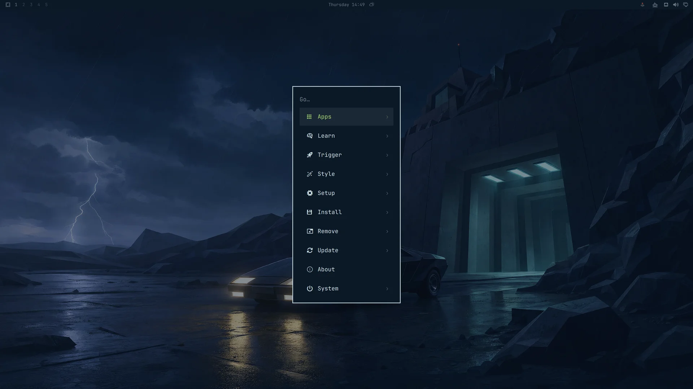](docs/screenshots/menu.webp) | [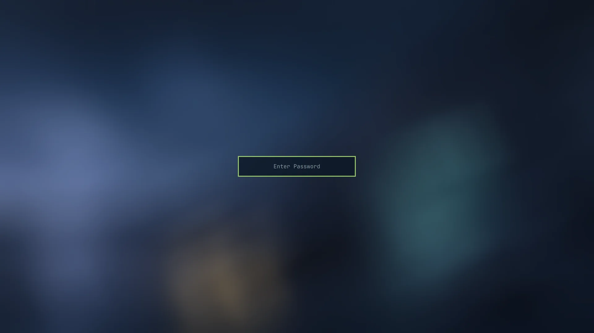](docs/screenshots/lock.webp) |

## Palette

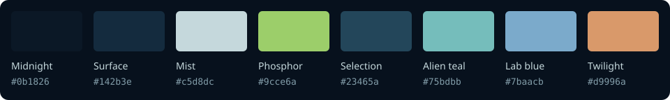

| Role | Color |
| --- | --- |
| Midnight background | `#0b1826` |
| Blue surfaces | `#142b3e` |
| Pale blue-gray text | `#c5d8dc` |
| Phosphor-green accent | `#9cce6a` |
| Deep teal selection | `#23465a` |
| Secondary text | `#829da9` |
| Alien teal | `#75bdbb` |
| Laboratory blue | `#7baacb` |
| Twilight orange | `#d9996a` |

`colors.toml` contains the theme palette, including bright terminal variants. `icons.theme` selects `Yaru-prussiangreen`.

Opaque-color contrast: primary text **12.13:1** on the background; primary text **6.79:1** on selection. Transparency and application customizations may change these results.

## Compatibility

Uses the [Omarchy 4 central palette format](https://omarchy.org/manual/making-your-own-theme/). Omarchy generates application configurations from `colors.toml`.

The original palette is shown running on Omarchy 4.0.3-1 in the screenshots above. The new `shell.toml`, boot artwork and terminal branding have been checked locally but still need a live check after installation.

## Image credits

Artwork created with OpenAI image generation. The five 4K wallpapers are native **3840 × 2160**, with no post-generation upscaling. Gallery previews are reduced copies. Desktop screenshots were captured in a running Omarchy session. The unlock emblem was generated with OpenAI and prepared with transparency; its [prompt and processing settings](prompts/README.md#unlock-emblem) are included.

An unofficial fan tribute to Éric Chahi and Delphine Software. Another World and its characters belong to their respective rights holders. This project is not affiliated with or endorsed by the original creators.
