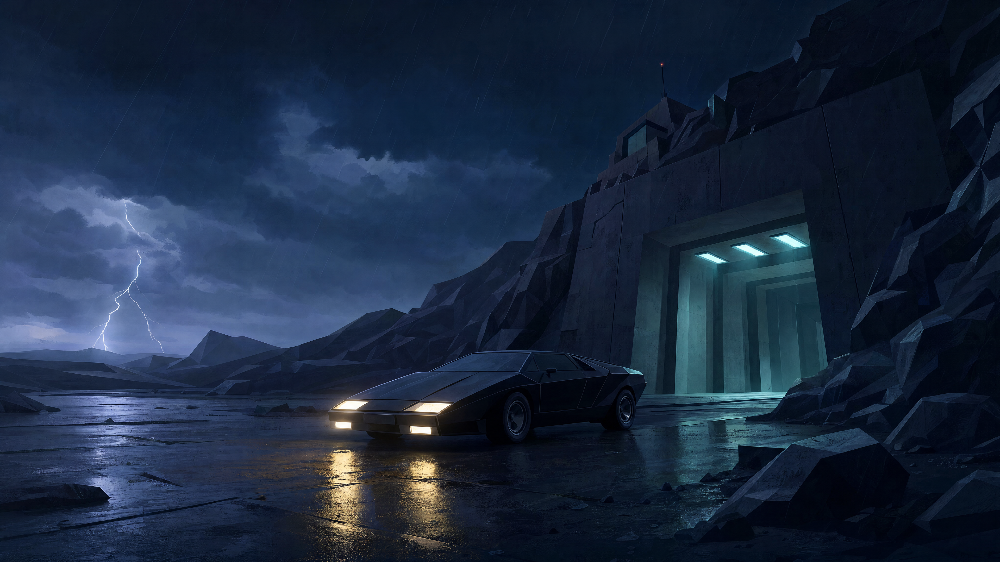

# Another World — Omarchy 4 Theme

A cinematic theme for Omarchy 4, paying tribute to **Another World**, the landmark 1991 Amiga game created by **Éric Chahi** and published by **Delphine Software**.



## From the Amiga to another desktop

Known as *Out of This World* in North America, Another World follows scientist Lester Knight Chaykin after a laboratory experiment transports him to a mysterious alien world. Its bold polygonal artwork, restrained palette and cinematic storytelling made an unforgettable impression on the Amiga era.

This project reimagines that atmosphere for [Omarchy](https://omarchy.org/): deep laboratory blues, muted alien teals, dark silhouettes and the vivid green glow of Lester’s terminal. The aim is to preserve the simplicity and sense of isolation of the original while introducing modern lighting and depth.

## Theme

The theme targets **Omarchy 4 / Quattro**. Its native `colors.toml` palette supplies the colors used by Omarchy's application templates, with matching Prussian-green file manager icons.

| Role | Color |
| --- | --- |
| Background — midnight laboratory | `#0b1826` |
| Foreground — pale blue-gray | `#c5d8dc` |
| Accent — phosphor green | `#9cce6a` |
| Cyan — alien water | `#75bdbb` |
| Blue — laboratory light | `#7baacb` |
| Orange — twilight | `#d9996a` |

## Installation

Once this version has been pushed to GitHub, run on Omarchy 4:

```sh
omarchy theme install https://github.com/simoz/omarchy-another-world-theme.git
```

You can also enter the repository URL under **Install > Style > Theme** in the Omarchy menu. Installation applies the theme.

To try a local checkout before publication, copy `colors.toml`, `icons.theme` and the `backgrounds` directory into `~/.config/omarchy/themes/another-world`, then select **Another World** in the theme menu or run:

```sh
omarchy theme set another-world
```

The palette follows the [official theme format](https://omarchy.org/manual/making-your-own-theme/). Desktop appearance still needs a live check on Omarchy; development and file validation were performed on macOS.

## Wallpapers

The wallpapers are AI-generated reinterpretations inspired by the game, rather than original game assets.

Complete prompts and API generation parameters for the 4K collection are preserved in [prompts/](prompts/README.md).

| Scene | 4K wallpaper | Complete prompt |
| --- | --- | --- |
| Alien landscape | [View](backgrounds/alien-landscape-4k.png) | [Prompt](prompts/alien-landscape-4k.txt) |
| Arrival at the laboratory | [View](backgrounds/00-arrival-4k.png) | [Prompt](prompts/arrival-4k.txt) |
| Underground escape | [View](backgrounds/underground-escape-4k.png) | [Prompt](prompts/underground-escape-4k.txt) |
| Alien city at twilight | [View](backgrounds/alien-city-4k.png) | [Prompt](prompts/alien-city-4k.txt) |
| Lester at the laboratory console | [View](backgrounds/laboratory-4k.png) | [Prompt](prompts/laboratory-4k.txt) |

All five new wallpapers are native **3840 × 2160 PNGs**, generated through the OpenAI Images API with `gpt-image-2` at high quality. No local upscaling was used.

**Arrival 4K** is the theme cover and preview. Its `00-` filename places it first in Omarchy’s sorted wallpaper list on initial application; an existing wallpaper selection can affect subsequent switches. The earlier wallpapers remain available alongside the `-4k` versions.

## Credits and inspiration

An unofficial fan tribute to Éric Chahi and Delphine Software. Another World and its characters belong to their respective rights holders. This project is not affiliated with or endorsed by the original creators.

Historical background: [Another World](https://en.wikipedia.org/wiki/Another_World_%28video_game%29).
